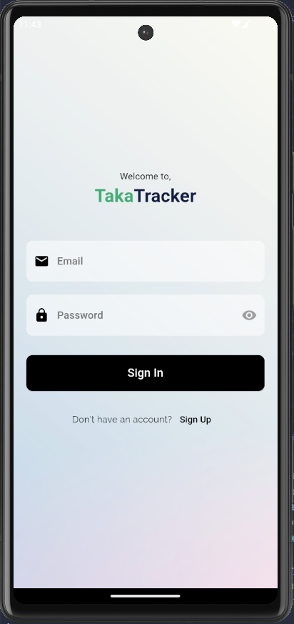
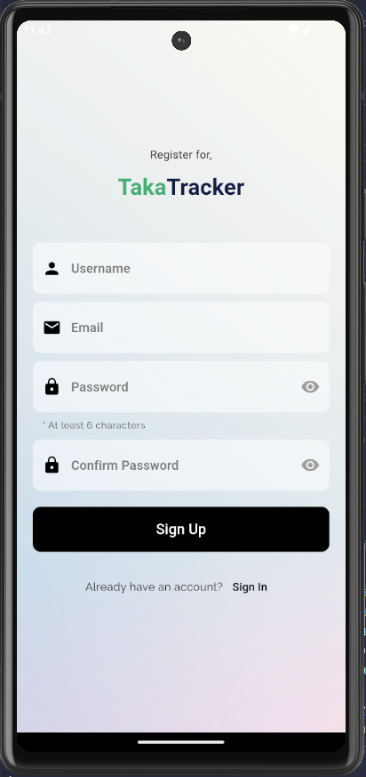
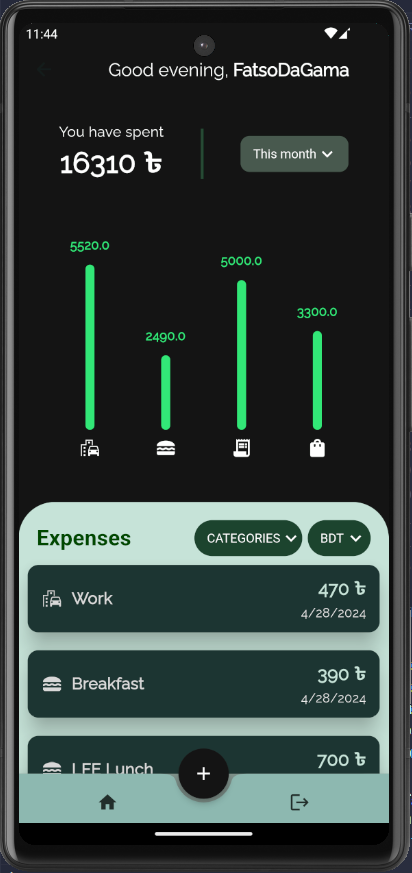

# Taka Tracker

A Flutter app for tracking your expenses

### Course: Mobile Applications

### Semester: Spring 2024

### Section: 03

### Group 1

### Team Members:

- [1911116](https://github.com/ishraqfatin) - Fatin Ishraq Ahammed
- [1910279](https://github.com/RHShihab) - Rahat Hasan Shihab
- [1911041](https://github.com/JoyitaF) - Joyita Faruk

## Project Description and Scopes:

This is an expense tracking app with the convenience of viewing your expenses at a glance.
 
Added functionalities include:

- Filter expenses graph by week/month/year
- View total amount spent in a week/month/year
- Filter expenses list by Categories
- Currency conversion (_additional feature_)

## Tools used:

- Flutter
- Firebase
- Fl Charts
- Google Fonts
- Dart

## Screenshots of the pages:

<!-- If the images are not visible, please navigate to [/screenshots](----Provide screenshots folder link----) folder -->

### Login/Registration Pages:

#### Log in:

 

#### Register:

### Dashboard:

### New Expense Form:

